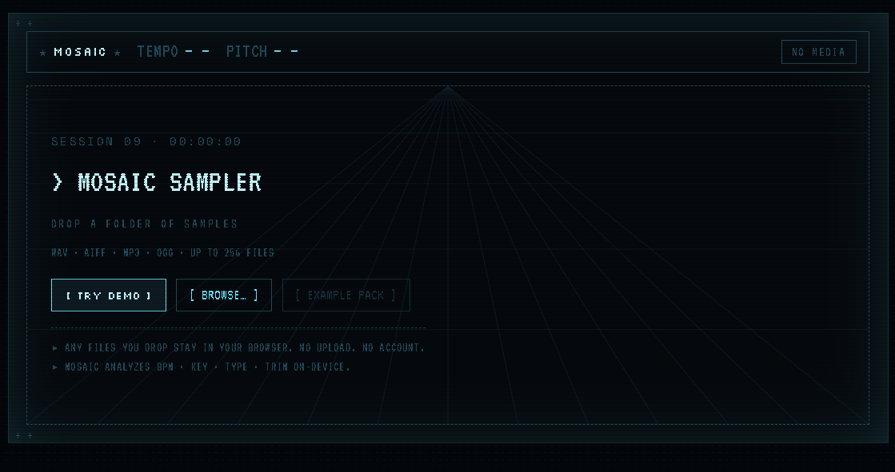
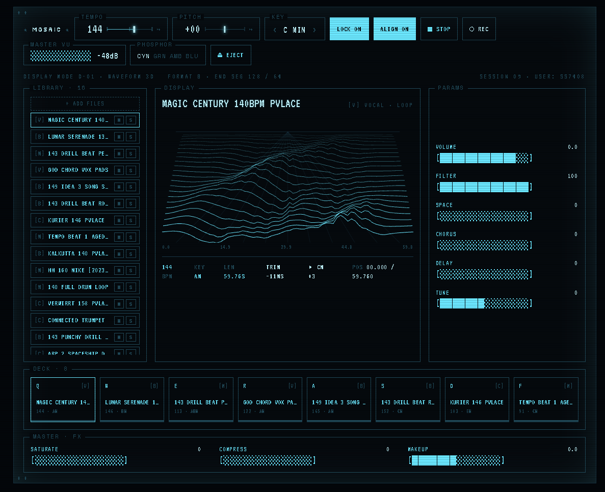

# Mosaic

**Drop a folder. Build a vibe.**

Mosaic is a tiny browser-based sampler drawn as a **CRT terminal** — monochrome
phosphor, bitmap type, ASCII waveforms and faders, box-drawing frames,
inverse-video selection, scanlines. Point it at a folder of sounds; it listens to
each file, auto-trims the silence off the front so everything starts at 0, and
lays them out on a key deck you can play. Loops lock to the tempo, four ASCII
faders shape the selected sound, and that's it.

Phosphor is themeable from the status bar: **GRN** (green), **AMB** (amber),
**BLU** (Minitel blue).

## Screenshots

Drop a folder (or hit **TRY DEMO**) and Mosaic analyzes BPM · key · type · trim
on-device — no upload, no account:



Then play: a library bin, a 3D wireframe of the selected sample, ASCII faders,
the 8-slot key deck and master FX. Press **Q W E R / A S D F** to punch the deck,
and click a sample's `[letter]` to correct its type:



```bash
npm install
npm run dev        # http://localhost:5173
```

No audio assets needed — add the `-- Upload Me` folder and Mosaic is ready to 
experiment with, 

## The device

- **Display** — an ASCII waveform of the selected sample (drawn in block
  characters, not canvas), with a playhead while a loop runs, plus its tempo /
  key / length and the `TRIM -Nms` readout.
- **Params** — five ASCII faders for the selected sample: **Volume**, **Filter**,
  **Space** (reverb), **Chorus**, **Delay**. Drag horizontally, scroll, or
  double-click to reset. (Chorus/Delay/Space are sends to shared master effects.)
- **Library** — the side bin of every loaded sample. **Drag a row onto a deck
  slot** to arrange it; **M / S** mute and solo. Click to load it on the screen.
- **Deck** — 8 playable slots. Tap to play + focus; playing slots go
  inverse-video. **Drag a slot onto another to swap**, or drop a Library sample
  in. Loops latch (tap again to stop), one-shots fire once. Role is a letter
  (`[D]` drums, `[B]` bass, …), not a colour.
- **Status bar** — tempo, **master Pitch** (transposes everything), the **Align**
  toggle, stop-all, master VU meter, phosphor theme switch, eject.

### Align (trim leading silence)

On load, `analyzer.js` finds where each sample actually starts and stores a
`trim` offset (with a ~3ms pre-roll so transients aren't clipped). The **Align**
toggle plays from that point, so hitting a key is instant and tight. Two demo
one-shots ship with deliberate leading silence so you can see it work.

## Architecture

```
src/
  audio/
    engine.js      Tone.js sampler — GrainPlayer per voice, filter + reverb send
    analyzer.js    AudioBuffer -> metadata (duration, waveform, bpm, key, type, trim)
    demoPack.js    Synthesises the 8-sound demo pack to AudioBuffers
    musicTheory.js Note/key helpers (key readout)
  state/store.js   Zustand store — owns the audio side-effects
  components/       Device, Screen, Encoders, SampleKeys (deck), Library,
                    AsciiWave, AsciiBar
  lib/ascii.js      String builders: meters, faders, waveform resampling
  styles/global.css Tokens (3 phosphor themes) + the CRT stylesheet
  brand.js         Product identity in one place
```

Each sample is a `Tone.GrainPlayer`, giving independent **tempo-stretch**
(`playbackRate`) and **pitch** (`detune`) — a 124 BPM loop can lock to a 90 BPM
project without chipmunking. Loops drop in on the bar; one-shots fire on the next
1/16.

### Swapping in real analysis

BPM / key / type in `analyzer.js` are lightweight in-browser DSP heuristics, each
behind a stable function signature returning a fixed metadata shape. Replace the
bodies with Essentia.js / aubio (wasm) / a Web Worker and nothing downstream
changes.

Built with React, Tone.js, Zustand, Phosphor Icons. Dark, single-screen, fixed.
